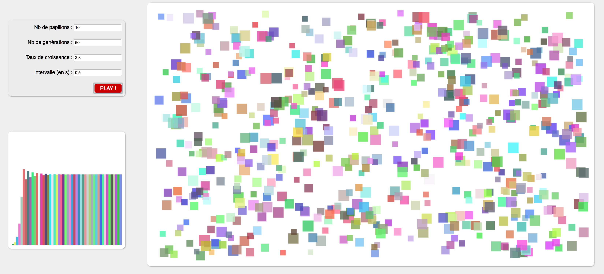

# Butterflies

## Description

In mathematics I had to do a simulator of the evolution of butterflies.

For example, if you have 100 butterflies and a low growth rate, after many generations they will eventually die. 
If you have a normal growth rate their population will stabilize. 
Finally if there is a high growth rate, the population will be high but, due to a lack of food, many butterflies will die.

I first developped this algorithm in Python, then I designed a graphical interface in Javascript.

## How to use

This interface is in french so :

     * Nb de papillons is how many butterflies are living at the start
     * Nb de generation is how many generation you want to simulate
     * Taux de croissance is the growth rate
     * Intervalle (en s) is the speed of interval between two generation